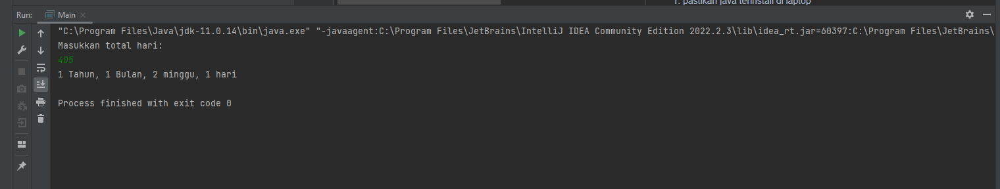

# Tugas Introduction to Programming

Project ini dibuat untuk tugas membuat perhitungan konversi hari menjadi tahun bulan minggu dan hari

Contoh:
```
Masukan user: 405
Ouput program: 1 Tahun, 1 Bulan, 2 Minggu, 1 hari
```

Cara menjalankan program ini:
1. pastikan java terinstall di laptop
2. run program menggunakan Eclipse atau Intellij IDEA

Contoh output
